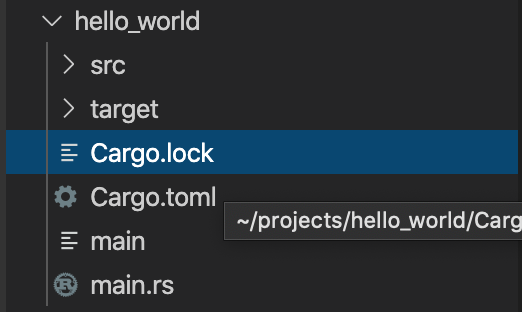
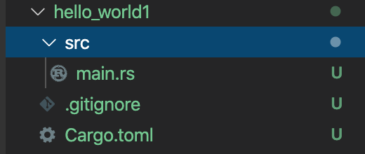

# Rust 程式語言

```
作者：陳楷茗
日期：2020/6/10
```  

> 說明: 本報告的節錄內容主要來源為 --    
電子書：  
[Rust 程式設計語言](https://doc.rust-lang.org/book/title-page.html),Nicholas Matsakis and Aaron Turon.    
[Rust 程序设计语言（第二版 & 2018 edition）简体中文版](https://kaisery.gitbooks.io/trpl-zh-cn/content/)   
[Rust 程式設計语言 繁體中文版](https://askeing.github.io/rust-book/getting-started.html)  
書籍：  
[Rust 編成之道](https://www.tenlong.com.tw/products/9787121354854),張漢東  
- - -

## 前言    
本文由 Mac OS 系統操作演練，如閱讀者為 Windows 系統使用者以及尚未安裝Rust
，詳細內容請閱讀[Rust程式語言正體中文版](https://askeing.github.io/rust-book/getting-started.html)。
- - -

## 簡介  

Rust 是由[ Mozilla ](https://zh.wikipedia.org/wiki/Mozilla)主導開發的通用、編譯型程式語言。 Rust 的發明初忠是建立在追求安全、開發和高性能的現代系統編程語言。為了達成目標， Rust 語言遵循著內存安全、零成本抽象和實用性三大設計哲學。 Rust 語言有別於傳統語言的另一點在於，其將開源社區是為語言的一部分而Rust本身就是開源項目中的典範，非常直得學習。
- - - 

## 一、 Hello, World!
### （一）建立專案   
要建立出一個 Rust 程式，首先我們要先知道只要是 Rust 的檔案都是以 <code>.rs</code> 副檔名作為結尾，若檔名使用超過一個單字以上，就必須使用底線去分割他們，如本次練習要以 hello_world.rs 來命名，而非 helloworld.rs 。  

```
fn main() {
    println!("Hello, world!");
}
```  
儲存檔案後，開啟終端機並輸入以下指令以執行結果：

```
% rustc main.rs
% ./main
Hello, world!
```  
若以上執行成功，那麼恭喜你完成了你第一個 Rust 程式。  

### （二）語句與表達式  
執行成功後相信大家對於 Rust 的撰寫方式也相當好奇，讓我們來探索剛才執行的「hello_world」程式吧。  
```
fn main() {
   println!("Hello, world!");
}
```  
在分析「hello_world」程式之前，我們必須先瞭解 Rust 中的語法可分為語句和表達式，語句是指要執行的一些操作和產生副作用的表達式，而表達式主要用於計算求值。其中語句又可分為兩種：  
>* 聲明（陳述）語句：用於聲明各種語言項，包含聲明變量、靜態變量、常量、結構體、函數等，以及通過extem 和 use 關鍵字印入包和模組等。（本練習並未出現，因為 Rust 會為每個crate都自動引入標準庫模組，除非使用＃[no_std]屬性指定不使用標準庫）  
>* 表達式語句：特指以分號結尾的表達式，此類表達式求值結果將會被捨棄，並總是返回單元類型( )。   


在「hello_world」程式中，關鍵字 <code>fn</code> 是函式(function)的縮寫，而程式中的函式沒有參數也沒有回傳值，若函式有參數的話，參數會放在括號中，本練習因為我們不回傳值，所以可以省略回傳的型態。其中 main 是所有 Rust 程式的起始點，Rust 的函式內容會被包在大括號內。  
 
 在「hello_world」程式中大括弧內負責這個程式的主要工作，透過 <code>println!()</code> 這行將括號內所輸入的文字印出來，在 Rust 中它叫做巨集（macro），對於為什麼 <code>println!</code> 後面為什麼要加一個！，由於目前還沒閱讀到後面的章節，若想先了解的讀者詳細內容請閱讀電子書原文[4.34 macro](https://askeing.github.io/rust-book/macros.html)，所以現在只需知道，當看到 ! 的時候，代表你正在呼叫一個巨集，而非一般的函式。
>請特別注意！縮排是四個空白，而不是 tabs。縮排是四個空白，而不是 tabs。

當Rust 編譯器在解析代碼的時候，如果碰到分號就會繼續往下執行; 如果碰到語句則執行語句; 如果碰到表達式，則會對表達是求值，如果分號後面什麼都沒有，就會補上單元值。  

### （三）編譯和執行  

在這裡將介紹 Rust 程式的執行流程，執行過程有點類似本學期所學的gcc，先使用編譯器透過輸入指令來編譯，編譯後再執行你所撰寫的檔案，由於本次使用的是 Rust 語言因此使用的是 Rust 編譯器並使用指令 <code>rustc</code> 來執行編譯，編譯成功後可透過 <code>ls</code> 指令看到一個二進位的執行檔，執行結果會顯示一個 main 的執行檔以及 <code>.rs</code> 的原始檔，成功看到編譯出來的執行檔案後，就剩下執行 main 執行檔就完成這整個過程囉！  
過程如下：  
```
% rustc main.rs       //編譯成執行檔
% ls                 //查看執行檔
% main main.rs
% ./main            //執行
Hello, world!
```  
- - -
## 二、 Cargo  
### （一）Cargo 基本介紹 
>Cargo 是 Rust 的建置系統跟套件管理器，而且 Rustaceans 會使用 Cargo 去管理他們的 Rust 專案。 Cargo 管理三件事：建置你的程式碼、下載你的程式碼所依賴的函式庫（libraries）、以及建置這些函式庫。 我們把這些你的程式所依賴的函式庫叫做「dependencies」，因為你的程式碼依賴他們。  
最簡單的 Rust 程式不會有任何 dependencies，所以現在你只會用到第一部份的功能。 當你撰寫更複雜的 Rust 程式後，你將會希望加入 dependencies，如果你從 Cargo 開始的話，那就會簡單很多。  


### （二）Hello, World! 轉換到 Cargo 

#### 1. 建立新的執行檔和原始碼目錄
以下操作為手動創建  

首先，我們要先完成一些前置作業，創建 src 目錄並將 <code>main.rs</code> 丟入，再將原本的執行檔移除，以上操作是為了配合Cargo，因為 Cargo 預期原始碼會放在 src 目錄內。  
>最上層的專案目錄（在此為 hello_world）被保留來放置 README 檔、授權資訊、及其他與程式碼無關的東西，如此一來可以使專案保持整潔。  

其操作如下：
```
% mkdir src                      //首先創建 src 資料夾
% mv main.rs src/main.rs         //將 main.rs 搬移至 src目錄下
% rm main                        //移除掉原先的執行檔
```
#### 2. 建立配置檔  
在 hello_world 目錄下建立一個新的檔案<code>Cargo.toml</code>來設定檔案格式。  

>* 確保 <code>Cargo.toml</code> 的 C 是大寫，否則 Cargo 會無法處理這樣的配置檔。  
>* TOML 跟 INI 很類似，但是有一些額外的好處，且被用來作為 Cargo 的配置格式。

建立完檔案後開啟並輸入以下資訊：  
```
[package]

name = "hello_world"
version = "0.0.1"
authors = [ "Your name <you@example.com>" ]
```
>第一行，[package] 表示以下的陳述是用來配置一個套件（package）。 當我們要加入更多資訊到這個檔案內，我們會增加其他的小節（sections），但是現在，我們只有套件的配置。  
其他三行設定了三項 Cargo 在編譯程式時所需知道的配置：程式的名字、版本、和作者。

完成後就可以準備來執行囉！

#### 3. 建立與執行Cargo
操作與先前使用 Rust 編譯器編譯後執行的方法有點像，只是以不同的形式來建立與執行，執行方式如下：  
```
[package]

% cargo build
    Finished dev [unoptimized + debuginfo] target(s) in 0.00s
% ./target/debug/hello_world
Hello, world!
```
#### 4. Cargo.lock
在我們執行<code>cargo build</code>後 Cargo 會自動建立一個叫做 Cargo.lock 的檔案，其內容如下：

  

打開檔案後我們會看到
```
# This file is automatically @generated by Cargo.
# It is not intended for manual editing.
[[package]]
name = "hello_world"
version = "0.0.1"
```
>Cargo 使用 Cargo.lock 去追蹤應用程式的 dependencies。這是 Hello World 專案的 Cargo.lock 檔。 因為此專案沒有任何 dependencies，所以檔案有點稀疏。 實際上，你不需要自己去碰這個檔案；你只要讓 Cargo 去處理就好了。
### (三）兩者的不同
```
兩者編譯指令:  
rustc  
cargo build  
```
前者使用 <code>rustc</code> 指令來編譯並將執行檔放置在原資料夾內，而後者使用 <code>cargo build</code> 指令來編譯，但 Cargo 會將資料放置在/target/debug/內。  
```  
兩者執行指令：  
./main  
./target/debug/hello_world
```
由於 Cargo 編譯後的執行檔放置在其他資料夾內，所以需要再詳細位置列出來，儘管現在所看到的 Cargo 建立並執行方式比起使用原先 Rust 的指令上多了些，不過其實 Cargo 還有一個更大的優勢是可以透過一個<code>cargo run</code>指令就完成上面的兩個步驟，方便又快速。  
操作如下：
```
% cargo run
    Finished dev [unoptimized + debuginfo] target(s) in 0.00s
     Running `target/debug/hello_world`
Hello, world!
```
>在簡單的專案中，Cargo 無法比 rustc 帶來更多好處，但是它在未來會越來越有用。 在用到許多 crates 的複雜專案中，使用 Cargo 去協調建置會比較簡單。 你只需要執行 cargo build，然後一切都會正確的運行。

### （四）自動創建Hello, World!
其實要在 Cargo 上創建一個新的檔案，不必要按照上面的步驟一步一步來，我們可以透過指令來完成所有操作，只需要輸入<code>cargo new</code>來創建，如下：
```
% cargo new hello_world --bin
     Created binary (application) `hello_world1` package
```
執行後會產生兩個檔案和一個目錄給我們，它們的結構與前面手動建立的幾乎一模一樣，差異不大。  
  
打開 src 目錄中的 main.rs檔後，我們可以看到 Cargo 會自動產生「Hello World!」程式碼，接著你就可以編寫你要的程式了。   
```
fn main() {
   println!("Hello, world!");
}
```  
- - -  

## 三、 語法與語意  
### （一）變數綁定
在 Rust 語言中，我們可以透過 <code>let</code> 指令來創建變數， <code>let</code> 所創建的變數一般稱為綁定，它表明了標示符和值之間建立的關係。  

#### 1. 位置表達式和值表達式
一般表達式在許多語言中可分為左值和右值，而在 Rust 中我們分為位置表達式以及值表達式 ，而什麼是位置表達式和值表達式呢？  
以下就讓我簡短介紹：
* 位置表達式：簡單來說就是表示內存位置的表達式，一般多用來進行寫的工作，這也是位置表達式可以被賦予值的原因。  
* 值表達式： 它相當於數據值，只能進行讀取的動作。 
> 從語意角度來說，位置表達式代表了持久性數據，值表達式代表了臨時數據。
#### 2. 不可變綁定與可變綁定
使用 <code>let</code> 指令宣告的位置表達式預設是不可變，為不可變綁定。  
以下介紹不可變綁定與可變綁定的例子：  

測試不可變綁定，修改後編譯器會報錯。
```
fn main(){
    let x = 1;
    println!("The value of x is: {}", x);  
        x = 10;   
    println!("The value of x is: {}", x); 
}
```
執行結果：
``` 
% cargo run
   Compiling immutable v0.1.0 (/Users/malik8811/projects/immutable)
error[E0384]: cannot assign twice to immutable variable `x`
 --> src/main.rs:4:9
  |
2 |     let x = 1;
  |         -
  |         |
  |         first assignment to `x`
  |         help: make this binding mutable: `mut x`
3 |     println!("The value of x is: {}", x);  
4 |         x = 10;   
  |         ^^^^^^ cannot assign twice to immutable variable

error: aborting due to previous error

For more information about this error, try `rustc --explain E0384`.
error: could not compile `immutable`.
``` 

以下為可變綁定，可修改。
```
fn main(){
    let mut y = 2;
    println!("The value of x is: {}", y);
            y = 20;
    println!("The value of x is: {}", y);       
}
``` 
執行結果：
``` 
% cargo run
   Compiling mutable v0.1.0 (/Users/malik8811/projects/mutable)
    Finished dev [unoptimized + debuginfo] target(s) in 0.27s
     Running `/Users/malik8811/projects/mutable/target/debug/mutable`
The value of x is: 2
The value of x is: 20
```   
範例中變數 x 預設是不可變綁定，故對他重新定義值後編譯器會報錯，如果透過 <code>mut</code> 指令，可以宣告可變的位置表達式，及可變綁定，可綁定便可以正常修改和賦值，如範例中的變數 y。  

#### 3. 隱藏(Shadowing)
當我們在 Rust 中，創建一個與前一個變數的名稱相同，而這一個新的變數會去隱藏之前的那一個變數，如以下練習： 
```
fn main() {
  
        let x = 10;
        let x = x + 10;
        let x = x * 4;
        println!("The value of x is: {}", x);
    }
```
執行結果
```
% cargo run
   Compiling shadowing v0.1.0 (/Users/malik8811/projects/shadowing)
    Finished dev [unoptimized + debuginfo] target(s) in 0.30s
     Running `/Users/malik8811/projects/shadowing/target/debug/shadowing`
The value of x is: 80
```  
由這個範例我們可以看到，起先我們先將 x 綁定為 10，接著利用 <code>let x</code> 來隱藏 x ，我們就會進到初始值加上 10 這行，便得到 x 變為 20 的值，依此類推，最終我們就得到 80 的結果。  

* 與 <code>mut</code> 的區別  

在這裡我們可以看到 <code>mut</code> 與 Shadowing 的區別，在於當我們再次使用 <code>let</code> 時，其實是再創建一個新的變數，因此可以改變值的類型，並且重複使用同一個名稱，而當我們使用指令 <code>mut</code> 時，我們雖然可以修改綁定的值，但我們卻無法改變這個變數的類型，證明如下：  
> 例如，假设程序请求用户输入空格字符来说明希望在文本之间显示多少个空格，然而我们真正需要的是将输入存储成数字（多少个空格）：
```
fn main(){
let spaces = "   ";
let spaces = spaces.len();
println!("All spaces are: {}", spaces);
}
``` 
在這一個程式中，第一個 spaces 變數代表的是字符串類型，而第二個 spaces 變數，它是與第一個變數同名的新變數，是屬於數字類型。Shadowing 使我們不必使用不同的名稱，如 spaces_str 和 spaces_num；相反，我們依然能繼續使用 spaces 為變數名稱，因此執行後能順利跑出我們要的解，如下：

``` 
cargo run
   Compiling proof_shadowing v0.1.0 (/Users/malik8811/projects/proof_shadowing)
    Finished dev [unoptimized + debuginfo] target(s) in 0.20s
     Running `/Users/malik8811/projects/proof_shadowing/target/debug/proof_shadowing`
All spaces are: 3
```
緊接著我們來使用 <code>mut</code> 操作。
```
fn main() {
  
    let mut spaces = "   ";
    spaces = spaces.len();
    println!("All spaces are: {}", spaces);
    }

``` 
執行時會在編譯時發現錯誤，結果如下：
```
cargo run
   Compiling proof_mut v0.1.0 (/Users/malik8811/projects/proof_mut)
error[E0308]: mismatched types
 --> src/main.rs:4:14
  |
4 |     spaces = spaces.len();
  |              ^^^^^^^^^^^^ expected `&str`, found `usize`

error: aborting due to previous error

For more information about this error, try `rustc --explain E0308`.
error: could not compile `proof_mut`.
```  
由此範例證明了 Shadowing 與 <code>mut</code> 的使用區別。  

### （二）基本型別  

#### 1.布林(Booleans)  
布林型別是一個可為 True 或 False 的資料型態。它常運用在對照及位元運算子上如<code>&</code>、<code>|</code> 和 <code>!</code>
```
fn main() {
    let x = true;
    let y: bool = false;

    if x {
        println!("x is true");
    }
}
``` 
執行結果
```
x is true
```
#### 2. 字符(Char)  
在 Rust 中，我們使用單引號來定義 <code>char</code>，它代表的是一個Unicode值，每個字符佔 4 個位元，以下為 <code>char</code> 類型的練習。  
>注意 char 由单引号指定，不同于字符串使用双引号。  
```
fn main() {
    let c = 'z';
    let z = 'ℤ';
    let heart_eyed_cat = '😻';
    
    println!("{} {} {}",c,z,heart_eyed_cat);
}
```
執行結果，我們可以看到 <code>char</code> 運用Unicod值，所以它可以比 ASCII 表示更多内容，如特殊文字及 emoji 等。
```
% cargo run
   Compiling char v0.1.0 (/Users/malik8811/projects/char)
    Finished dev [unoptimized + debuginfo] target(s) in 0.28s
     Running `/Users/malik8811/projects/char/target/debug/char`
z ℤ 😻
```  
#### 3. 陣列(Arrays)  
陣列的型別是<code>[T;N]</code>。T 是泛型標記，它代表陣列中元素的某個具體類型。N 代表陣列的長度，是一個編譯期的常量，必須在編譯時確定其值。  

陣列的特點：  
* 類組大小固定   
* 元素均為同類型
* 預設為不可變

以下為 array 測試，我們可以看到程式碼的內容，與上述的形式相符，先輸入類型再輸入長度。。
```
fn main(){
   let arr:[i32;4] = [10,20,30,40];
   println!("array is {:?}",arr);
   println!("array size is :{}",arr.len());
   println!("The third num is :{}",arr[3]);
}
```  
接著我們來設定要印出的內容，在這個步驟一開始我遇到了問題，當我想印出矩陣內的所有值，我依照前面所學的方式輸入 <code>println!("array is { }",arr);</code>，編譯的過程會顯示錯誤，但經過上網查詢後，才發現要使用 <code>println!()</code> 中的語法<code>{:?}</code> 才能將矩陣內的所有值印出。
```
% cargo run
   Compiling array v0.1.0 (/Users/malik8811/projects/array)
    Finished dev [unoptimized + debuginfo] target(s) in 2.60s
     Running `/Users/malik8811/projects/array/target/debug/array`
array is [10, 20, 30, 40]
array size is :4
The third num is :40
```
而我們也可以使用 <code>arr.len()</code> 來取得陣列中元素的個數，再使用 <code>arry[]</code> 指定要顯示的內容，在指定的過程，我們要記得在這裡與大多語言相同，第一個元素的名稱是 <code>arry[0]</code>， <code>[ ]</code> 為 0 而非 1，要避免犯下這個錯誤。  

#### 4. 切片(Slice)  
