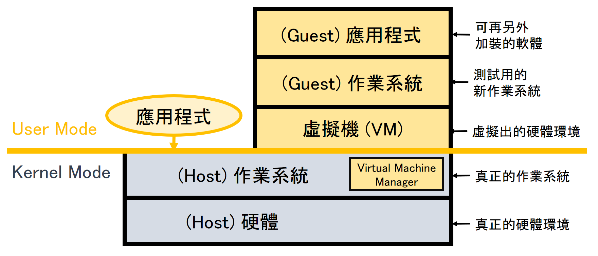
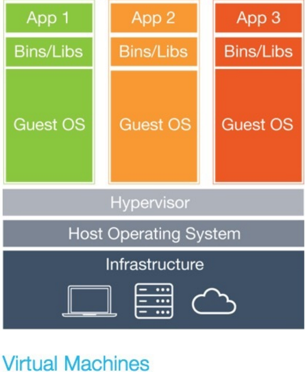
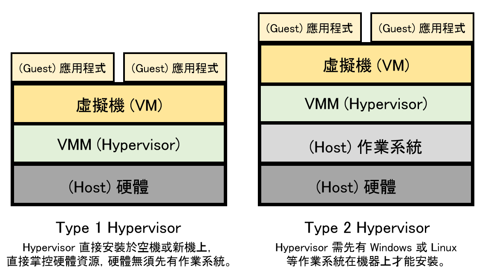
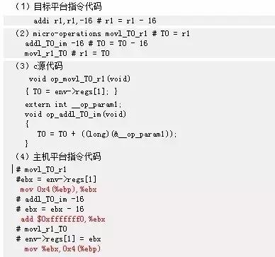

# 研究虛擬機
## 系統程式期中報告

資工二 110710545 陳楷茗 

---

目錄：
* 認識虛擬機及虛擬化

* 基本名詞與類型介紹  

* VMWare  
基本介紹  
特色  
運作原理
功能介紹  

* QEMU  
基本介紹
QEMU的三種運行模式  
QEMU動態翻譯器的實現  
* Xen  
基本介紹  
Xen 的虛擬類型與特色

---
## 認識虛擬機及虛擬化

虛擬機是行為類似實際電腦的電腦檔案 (通常稱作映像)。也就是我們常說的模擬器，這不是一台實體機器，而是利用軟體模擬硬體的方式，它就像任何其他程式一樣在視窗內執行，在虛擬機器上給予終端使用者的體驗就如同在主機作業系統本身一樣。在虛擬機器中所執行的所有軟體，都只能運用虛擬機器中的資源。虛擬機器自系統其餘部分隔離進行沙箱化，意味虛擬機器內的軟體無法自電腦本身逸出或竄改。如此便可製造出理想的環境，以便用來測試其它作業系統 (包括 Beta 版)、存取感染病毒的資料、建立作業系統備份，以及在作業系統上執行原本未打算執行的軟體或應用程式。

同一台實體電腦上可同時執行多部虛擬機器。對伺服器而言，多個作業系統會並行執行，並由一個稱作 Hypervisor 的軟體加以管理，而桌面電腦通常會採用一個作業系統來執行其程式視窗內的其他作業系統。每個虛擬機器都會提供自身的虛擬硬體，包括 CPU、記憶體、硬碟、網路介面及其他裝置。虛擬硬體會對應到實體機器上的實際硬體，藉此減少對實體硬體系統的需求，達到節省其花費，以及其相關的維護費用，同時減少對電力及冷卻力的需求。

虛擬機大致可被劃分為虛擬系統以及虛擬程序。系統虛擬機器是一個可以執行作業系統的平台，而程序虛擬機器則顧名思義只能執行某個特定的程序。虛擬系統又會因為虛擬技術的不同，而有所差別。例如，虛擬化技術分成全虛擬化與半虛擬化，這會影響到虛擬機器所能使用的硬體資源與作業系統的選擇。
##### 全虛擬化
全虛擬化完全依賴自己所建構的虛擬硬體層，Guest OS所能利用的硬體資源，會受限於虛擬出來的硬體資源，比較無法挪用實體的電腦硬體。除了中央處理器、記憶體，主機板之外無法模擬之外，舉凡BIOS、顯示卡等等都可以被模擬，但必須安裝專屬的驅動程式。其優點就是不管在怎樣的硬體環境中，Guest OS都能夠維持比較一致的相容性，而且可以使用與實體機器不同的作業系統。至於全虛擬化的缺點，則是會造成實體機器較大的負擔。舉例來說，1個Windows作業系統的使用者，可以虛擬一台使用Linux作業系統的電腦，並且在不改變實體資源配置的方式下執行2台電腦。  
##### 半虛擬化
半虛擬化並不在硬體之上配置虛擬層，而是將多個記憶體位置程式，變成可以在不同時間呼叫。半虛擬化可以讓Guest OS共享硬體資源，優點就是硬體不用將效能浪費在模擬硬體層之上，然而缺點就是虛擬機器中的作業系統必須與實體環境一致。

---
## 基本名詞與類型介紹

 
  

  
**VM(Virtual Machnie)** - 虛擬機器，就是經由硬體虛擬化的軟體所產生的虛擬電腦。  

**VMM(Virtual Machnie Monitor)** - 簡稱 VMM、又叫 Hypervisor，是一種運行在物理伺服器和操作系统之間的中間軟體層,可允許多个操作系统和應用共享一套基處物理硬體，因此也可以看作是虛擬還境中的“元”操作系统，它可以協調訪問伺服器上的所有物理設備和虛擬機，也叫虛擬機監視器。  

**Host OS** - 指實際上存在的電腦作業系統，也就是執行硬體虛擬化軟體的電腦。  

**Guest OS** - 指在硬體虛擬化的軟體中運作的虛擬電腦作業系統，也就是經由硬體虛擬化的軟體所產生的虛擬作業系統。 

###### VMM(Virtual Machnie Monitor)的建置 

Hypervisor是運行在物理机之上，為多台虛擬機提供能夠宿主在物理主機之上的基礎環境。
其实Hypervisor可以分為兩種：

 
 
I型--裸機型，直接運行在物理設備之上，是一種基於内核的虛擬機。這種類型的Hypervisor所扮演的角色是一种抽象概念的OS。

II型--宿主機型，運行在宿主機器的操作系统上創建硬體全仿真實例。Hypervisor勾建出一整套虛擬硬體平台（CPU/Memory/Storage/Adapter），上面需要你再去安装新的操作系统和需要的應用軟體，這樣底層和上層的OS就可以完全無關化。  

##### 兩者比對： 

| 因素      | 裸機型     | 主機型     |
 -------- | :-----------:  | :-----------: 
| 性能     | 性能高，資源開銷少，高级的資源控制。     | 性能較差，資源開銷大有限的資源控制，虛擬機競爭資源。     |
| 硬體兼容性     | 沒有太多要求，因为虛擬化平台運行在傳統操作系统之上，有操作系统硬體的驅動程序支持。    | 運行在經過認證的有限的軟、硬體集合内。    |
| 易用性     | 安装容易，但配置很複雜。     | 安裝、使用和維護都很簡單，不需要專門的技能。     |
| 高可用性     | 高可用性，主機發生故障时能夠提供持續的可用性     | 缺少高可用特性，主機發生故障時，故障解決前虛擬機將處於停機狀態。    |
| 可靠性     | 可靠性高，hypervisor經過很多QA（quality-assurance）測試和嚴格的硬體認證。直接運行在硬體上，而不是主機操作系统，減少了一个可能發生故障的组件。     | 主機型hypervisor使用通用的硬體並沒有對虛擬化進行專門的測試。     |
| 產品     |  Xen, Oracle VM Server for SPARC, Oracle VM Server for x86, Microsoft Hyper-V and VMware ESX/ESXi.     | VMware Workstation, VMware Player, VirtualBox, Parallels Desktop for Mac and QEMU     | 

---
## VMware
#### 基本介紹
VMware是一個可以使你在一臺機器上同時執行二個或更多Windows、LINUX等系統。它可以模擬一個標準PC環境。這個環境擁有可提供與實體硬體功能相同的虛擬裝置，如晶片組、CPU、記憶體、顯示卡、音效卡、網絡卡、軟碟機、硬碟、光碟機、串列埠、並口、USB控制器等，但這些裝置更易於攜帶、管理，且更加安全。  
#### 特色
* 可同時在同一台PC上運行多個作業系統，每個OS都有自己獨立的一個VM，就如同一個獨立的PC，相互之間還可以逕行對話。
* 可以在VM上安裝同一種作業系統的另一發行版，不需要重新對硬碟進行分割；此外，虛擬硬碟也可建在隨身攜帶的硬碟上，還可以建立在伺服器上，如果願意，也可以放在一個以劃分好的分割區域上。
* 虛擬硬碟實際上是Host OS下的一個文件，對於Guest OS，它永遠被看作是一個IDE硬碟；因此VM之間可共用文件、應用、網路資源等，也可以在同一台電腦上使用另一台VM的所有資源。
* 在VMware中模擬了多個按鍵，分別代表VM Power On、VM Power Off、Reset鍵等等。這些按鍵的功能就如同真正的按鍵一樣，如果你的Guest OS是Windows，而你不是經由正常關機程序關閉的話，下次啟動Windows的時候，Windows就會自動進行硬碟的檢查與修復工作。

#### 運作原理  
VMware直接使用了X86的保護模式，使得在一台X86電腦上同時運作多個不同的作業系統，例如Linux、Windows等，並且在多個作業系統同時運行的情況下，各作業系統完全是獨立運作的，不會互相影響。VMware在Guest OS與Host OS之間加了一層虛擬操作平台，所有的Guest OS都運行在虛擬操作平台之上，使得VMware支持同時運行多個Guest OS。
#### 功能介紹  
##### VMware-Guest OS的運行提供三種選項：

* persistent-Guest OS運行中所做的任何操作都即時存檔
* undoable-Guest OS shutdown時會問是否對所做的操作存檔
* nonpersistend-Guest OS運行中所做的任何操作，在shutdown後等於沒做過，可以用來進行軟體測試或試驗。  
##### VMware網路設置方式

* Bridged - 用這種方式Guest OS的IP可設置成與Host OS在同一網域，Guest OS相對於網路內的一台獨立的機器，因此Guest OS與Host OS可以在網內互相聯繫。  

* NAT - 這種方式也可以實現Guest OS與Host OS的雙向聯繫，但網路內其他機器不能連到Guest OS，而Guest OS可通過Host OS用NAT協定連到網路內其他機器。 
---
## QEMU  
#### 基本介紹  
QEMU是一個支持跨平台虛擬化的虛擬機，有user mode和system mode兩種配置方式。其中QEMU在system mode配置下模擬出整個計算機，可以在QEMU之上運行一個操作系统。QEMU的system mode與常見的VMware和Virtualbox等虛擬機比較類似，但是QEMU的優勢是可以跨指令集。例如VMware和Virtualbox之類的工具通常只能在X86計算機上虚擬出一個X86計算機，而QEMU支持在X86上虛擬出一個ARM計算機。 QEMU在user mode配置下，可以運行跟當前平台指令集不同的平台可執行程序。例如可以用qemu在X86上運行ARM的可執行程序，但是兩個平台必須是同一種操作系统，如Linux。  

##### QEMU由以下子系統組成：
* CPU仿真器( X86, PowerPC, ARM, Sparc )  
* 仿真設備，如VGA、串行接口、PS/2滑鼠和鍵盤、IDE硬碟、網卡等。  
* 將仿真設備連接到相應主機設備的通用設備，例如塊設備、字符設備、網絡設備等。  
* 機器描述，實例化仿真設備
* 調試
* 用戶接口  

#### QEMU的三種運行模式  
第一種模式是通過kqemu模組實現核心狀態的加速。通過在内核中加入kqemu的相關模組，在用戶狀態的QEMU則通過訪問/dev/kqemu設備文件接口調用改進型加速。在這種模式中，主要針對虛擬機和宿主機運行於统一架構的情况下進行虛擬化。

第二種模式是在用戶狀態直接運行QEMU，由QEMU對目標機的所有指令進行翻譯後執行，相當於全虛擬化。在這種模式下，可以運行各種不同形太的體系結構，如Android開發環境中即使用了QEMU來為其模擬ARM運行環境，但是在這種模擬環境下，每一條目標機的執行指令都需要耗費少則數個，多則成千上萬個宿主機的指令周期来模擬實現，速度方面不太理想。

第三種模式则是KVM官方提供的kvm-qemu加速模式。運行在核心狀態的KVM模組通過/dev/kvm字符設備文件向外提供操作接口。KVM通過提供libkvm這個操作庫，將/dev/kvm這一層面的ioctl類型的API轉化成為通常意義上的函數API調用，提供给qemu的相應適配層，通過qemu的支持来完成整個虚擬化工作。

針對這三種不同運行模式的測試结果表明，通过KVM對QEMU進行加速從而獲取的性能最為理想。

#### QEMU動態翻譯器的實現
動態轉換器執行VCPU指令到Host指令集的運行時轉換。 所得到的二進位代碼存儲在翻譯緩存中，以便可以重用它。 與解釋器相比的優點是目標指令僅被取出和解碼一次。

通常，動態翻譯器難以從一個主機埠傳輸到另一個主機，因為整個代碼生成器必須被重寫。它代表與向C編譯器添加更多相同的代碼。 QEMU簡單得多，因為它只是連接了由GNU C編譯器在線生成的機器代碼。

##### 便攜的動態翻譯
* 描述  
第一步是將每個目標CPU指令分成更簡單的簡單指令，稱為微操作。每個微操作都由一小段C代碼實現。這個小C代碼由GCC編譯為一個對象文件。微操作的選擇會使得它們的數量比VCPU的指令和操作數的所有組合小得多（通常是幾百個）。從VCPU指令到微操作的轉換完全是用代碼來完成的（軟體的方式）。原始碼針對可讀性和緊湊性進行了優化，因為此階段的速度與解釋器相比不太重要。  
編譯時工具dyngen使用包含微操作的對象文件作為輸入來生成動態代碼生成器。這個動態代碼生成器在運行時被調用以產生一個連接幾個微操作的完整主機功能。  
在編譯時要做更多的工作來獲得更好的性能。特別地，一個關鍵思想是在QEMU中可以給定常數參數進行微操作。為此，為每個常量參數使用GCC生成虛擬代碼重定位。這使得dyngen工具能夠定位重定位，並在生成動態代碼時生成適當的C代碼來解決這些錯誤。還支持重定位，以便在微操作中引用靜態數據和其他功能。
* 例子:  
假設我們要仿真PowerPC，宿主機host為x86，下面說明整個翻譯過程：

 
  
 在x86上 T0匹配ebx寄存器，cpu狀態的上下文信息保存在ebp寄存器上  

* Dyngen實現  
dyngen是QEMU翻譯的關鍵。在包含微操作的對象文件上運行時執行以下任務：  
(1)目標文件被解析以獲取其符號表，它會重定向入口及其代碼段。依賴於主機對象文件格式（dyngen支持ELF（Linux），PE-COFF（Windows）和MACH-O（Mac OS X)）。  
(2)微操作使用符號表位於代碼段中。執行主機特定方法來獲取複製代碼的開始和結束。通常，跳過功能序言和結尾語。  
(3)檢查每個微操作的重定位以獲取常數參數的數量。通過使用特定符號名稱_op_paramN來檢測常量參數重定位。  
(4)生成C中的存儲器副本以複製微操作代碼。每個微操作的代碼的重定位都用於修補複製的代碼，使其被正確地重新定位。遷移修補程序是主機特定的。  
(5)對於某些主機（如ARM），必須將常數存儲在生成的代碼附近，因為它們是通過一個小的位移來訪問的。完成主機特定的傳遞，以在生成的代碼中重定位這些常量。  

當編譯微操作代碼時，使用一組GCC標誌來將功能序言和結尾碼的生成操作為易於解析的形式。虛擬組裝宏強制GCC通過單個返回指令總是終止與每個微操作相對應的功能。如果在單個微操作中產生幾個返回指令，則代碼級聯將不起作用。 

---
## XEN
#### 基本介紹
Xen 是以 GNU 的 GPL 授權發佈的自由軟體，目的在於提供效能佳、可支援不同作業系統的同時運作、 且讓同時運作的作業系統彼此互相獨立的系統環境。Xen 是基於 X86 硬體所開發出來的虛擬機器監督器 (Virtual Machine Hypervisor) 。  
#### Xen 的虛擬類型與特色
Xen 這套自由軟體在虛擬機器的模擬類型方面主要分為半虛擬化 (Para-virtualization) 及全虛擬化 (Full virtualization) 兩種，其中半虛擬化主要是透過修改 Linux 核心來達成的虛擬技術。 半虛擬化技術所產生的虛擬機器需要與原本的作業系統相同較佳。使用半虛擬化的環境所具備的特色有：  

* 虛擬機器的運作效率與實體機器的效能相當；  
* 最多可支援到具有 32 顆以上 CPU 的主機環境；  
* 支援 x86/32, x86/32 含 PAE 技術, 及 x86/64 的硬體平台環境；  
* 良好的硬體驅動程式支援，幾乎支援所有的 Linux 裝置之驅動程式；  
* Xen 的半虛擬化技術主要是用在相同版本的 Linux 上面，也就是說，如果妳想要使用半虛擬化的方式啟動多個虛擬機器，那麼那些虛擬機器全部都必須是相同的作業系統，甚至要求相同版本與相同核心的Linux distribution。

如果想要安裝不同版本的Linux或者是其他的OS(例如 Windows XP)時，就得要使用全虛擬化技術了。但是全虛擬化技術是有其限制的，當硬體滿足下列需求時，全虛擬化技術才能夠動作：  
硬體支援 Intel 的 VT 技術 (Virtualization Technology, Intel-VT)；  
硬體支援 AMD 的 SVM 技術 (Secure Virtual Machine, AMD-SVM or, AMD-V)。  
此外，上面提到的PAE指的是Intel的實體位址延伸技術 (Physical Addressing Extensions, PAE)，這項技術可讓原本僅支援到4GB實體記憶體的32位元硬體平台，可支援到最大64GB的記憶體，而且Xen幾乎可以在所有的P-II以上等級的硬體平台上面跑半虛擬化任務，如果不跑全虛擬化的話，其實效能確實是可以的。  

近來由於虛擬機器軟體的流行，加上x86電腦效能與CPU運算核心單元的增加，兩大x86 CPU製造商 Intel/AMD 都發表了新的整合到CPU的虛擬技術，分別是Intel的Vanderpool虛擬技術以及AMD的Pacifica技術。這些技術有的也支援Xen，這讓Xen的效能增進不少。  

---
  

